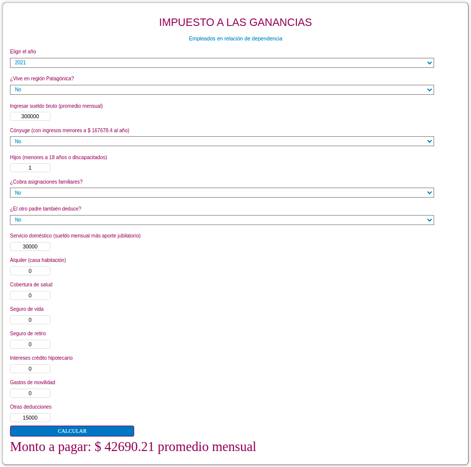

# Income Tax Calculator

_Read this in other languages: [English](README.md), [Español](README.es.md)._

This is a simple calculator done for embedding in the blog [Mi presupuesto familiar](https://www.presupuestofamiliar.com.ar/). It calculates how much you have to pay for income taxes in Argentina depending on your salary and your deductions.

For more information on how your salary and deductions will affect the amount in taxes you will pay, check [this article in the blog](https://www.presupuestofamiliar.com.ar/impuesto-a-las-ganancias-cuanto-vas-a-pagar-en-2022/).

I'm hosting the calculator in Github pages, check it out [here](https://joaquinfeltes.github.io/Calculadora_Ganancias/).

### Here's an example of the calculator working:

## 
